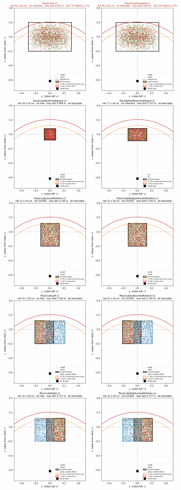

# Custom environments in this fork

This fork of [ManiSkill](https://github.com/haosulab/ManiSkill) adds a family of tabletop
environments derived from `StackCube-v1`, built for goal-conditioned policy training. Everything
here lives in `mani_skill/envs/tasks/tabletop/`; upstream code is otherwise unmodified.

## The environments

All ranges are metres relative to the table centre. The Panda base sits at `x = -0.615`, so a more
negative `x` is *closer* to the robot. `+y` is to the robot's left.

**Every environment below defaults to Panda except `PushBlock-v1`, which defaults to
`xarm6_nogripper`** (BESO's own robot family, and `panda` remains available as an opt-in)
— see "How Push Block works" below for why.

| env id | spawn x | spawn y | cube rotation | goal | file |
|---|---|---|---|---|---|
| `StackCube-v1` *(upstream, untouched)* | −0.20 … 0.20 | −0.30 … 0.30 | free | stack A on B | `stack_cube.py` |
| `StackCubeSwapped-v1` | −0.20 … 0.20 | −0.30 … 0.30 | free | stack **B on A** | `stack_cube_swapped.py` |
| `StackCubeRestrictedSpawn-v1` | −0.08 … 0.08 | −0.08 … 0.08 | free | stack A on B | `stack_cube_restricted_spawn.py` |
| `StackCubeLockedRotation-v1` | −0.20 … 0.12 | −0.13 … 0.13 | **locked** | stack A on B | `stack_cube_locked_rotation.py` |
| `StackCubeSwappedLockedRotation-v1` | −0.20 … 0.12 | −0.13 … 0.13 | **locked** | stack **B on A** | `stack_cube_swapped_locked_rotation.py` |
| `StackCubeClutter-v1` | −0.20 … 0.20 | −0.30 … 0.30 | free | stack A on B, **3–6 clutter distractors** | `stack_cube_clutter.py` |
| `StackCubeClutterRandomPick-v1` | −0.20 … 0.20 | −0.30 … 0.30 | free | stack **any pool object on any other**, drawn fresh per episode, 3–6 clutter distractors | `stack_cube_clutter_random_pick.py` |
| `StackCubeClutterLockedRotation-v1` | −0.20 … 0.12 | −0.13 … 0.13 | **locked** | stack A on B, 3–6 clutter distractors | `stack_cube_clutter_locked_rotation.py` |
| `StackCubeClutterRandomPickLockedRotation-v1` | −0.20 … 0.12 | −0.13 … 0.13 | **locked** | stack any pool object on any other (random per episode), 3–6 clutter distractors | `stack_cube_clutter_random_pick_locked_rotation.py` |
| `PlaceCubeLeft-v1` | −0.20 … 0.12 | −0.21 … 0.05 | free | A at B **+0.16 y** | `place_cube_left.py` |
| `PlaceCubeRight-v1` | −0.20 … 0.12 | −0.05 … 0.21 | free | A at B **−0.16 y** | `place_cube_right.py` |
| `PlaceCubeLeftLockedRotation-v1` | −0.20 … 0.12 | −0.21 … 0.05 | **locked** | A at B +0.16 y | `place_cube_left_locked_rotation.py` |
| `PlaceCubeRightLockedRotation-v1` | −0.20 … 0.12 | −0.05 … 0.21 | **locked** | A at B −0.16 y | `place_cube_right_locked_rotation.py` |
| `PlaceSphereRestrictedSpawn-v1` | −0.089 … 0.082 | −0.132 … 0.131 | inherited | sphere in bin | `place_sphere_restricted_spawn.py` |
| `PushBlock-v1` | −0.16 … −0.08 (cubes), 0.13 (targets, near-fixed) | ±0.14 (cubes, shared), ±0.09 (targets, near-fixed) | free | push A,B into two **distinct** targets, order-agnostic (matches BESO's own success rule) | `push_block.py` |

**There is exactlu one file per registered environment.**, e.g. `PlaceCubeLeftLockedRotation-v1` is in `place_cube_left_locked_rotation.py`.

Note that `*LockedRotation-v1` environments restrict the spawn *as well as* locking rotation — the name only mentions the more distinctive of the two.

The spawn x/y columns above describe cubeA/cubeB only. `StackCubeClutter*` environments also
scatter 3–6 extra distractor objects across a wider region (`x ∈ [-0.25, 0.25]`,
`y ∈ [-0.35, 0.35]`) that isn't captured by those columns — see "How the clutter variants work"
below.

## Spawn regions



1500 spawns per environment at seed 0, viewed top-down. Each row is a pair: the left column is a base
task, the right column the variant derived from it. Note the axes are transposed relative to
the usual plot convention: **y (the robot's left) is horizontal, x (away from the robot) is
vertical**, so the layout matches what you see in a render. The black square at the bottom of each
panel is the Panda base at `x = -0.615`.

Reading a panel:

- **red** = cubeA, **green** = cubeB (`obj` / `bin` on the sphere panel), **blue** = the goal, i.e.
  `cubeB + TARGET_Y_OFFSET`, on the `PlaceCube` panels only. Which cube the robot picks up depends
  on the task — cubeA everywhere except the swapped variants, which pick up cubeB
- **solid black box** = the declared spawn region. On the two vanilla-spawn panels a **dotted grey
  box** shows the rejection sampler's own bounds, with the solid box being the wider envelope that
  `SHARED_XY_OFFSET` produces on top of it
- **dashed blue box** = where the goals land
- **red arc** = the ~0.82 m outer limit of the Panda's reach; **orange arc** = 0.736 m, the worst
  case actually observed in the restricted envs

The two vanilla-spawn environments (`StackCube-v1`, `StackCubeSwapped-v1`) are the only ones that
cross the reach arc, with ~0.17% of spawns outside it — which is what caps motion planning on
`StackCube-v1` at ~0.975 rather than 1.0. Every restricted variant sits entirely inside.

On the `PlaceCube` panels the solid and dashed boxes together span a symmetric ±0.21 m in y, with
neither crossing the reach arc: that is the `GOAL_Y_LIMIT` construction described below. Left and
Right are exact mirrors.

Several panels are deliberately indistinguishable from each other, because the figure only shows
position: `LOCK_Z_ROTATION` changes yaw alone, and `StackCubeSwappedLockedRotation-v1` differs from
`StackCubeLockedRotation-v1` only in which cube is picked up. Those pairs are in fact bit-identical
in spawn at a given seed — the difference is in the task, not the layout.

## How the spawn variants work

`ConfigurableSpawnStackCubeEnv` (`configurable_spawn_stack_cube.py`) is a non-registered base class
that exposes `StackCubeEnv`'s cube spawn as five class constants:

| constant | meaning | vanilla value |
|---|---|---|
| `CUBE_X_RANGE`, `CUBE_Y_RANGE` | rejection-sampling bounds for both cubes | `(-0.1, 0.1)`, `(-0.2, 0.2)` |
| `SHARED_XY_OFFSET` | per-episode shift applied to both cubes, leaving their separation unchanged; `0` disables it | `0.1` |
| `SPAWN_CLEARANCE` | added to the cube circumradius when rejection sampling, i.e. how far apart the two cubes must land | `0.001` |
| `LOCK_Z_ROTATION` | spawn cubes at identity yaw instead of a random one | `False` |

At the defaults it reproduces `StackCubeEnv._initialize_episode` exactly, RNG draws included.
Variants override constants; none of them reimplement the spawn.

**One exception to the single-inheritance pattern.** `StackCubeSwappedLockedRotation-v1` combines two
otherwise orthogonal parents:

```python
class StackCubeSwappedLockedRotationEnv(StackCubeSwappedEnv, StackCubeLockedRotationEnv):
    ...  # no body
```

`StackCubeSwappedEnv` owns the *task* (`evaluate`, `compute_dense_reward`) and descends straight from
`StackCubeEnv`; `StackCubeLockedRotationEnv` owns the *spawn* (`_initialize_episode` via the base,
plus the four constants). The MRO is
`Swapped → LockedRotation → ConfigurableSpawn → StackCube`, so each concern resolves to the parent
that defines it and there is nothing to write in the body. Neither parent is modified, and its
spawn is bit-identical to `StackCubeLockedRotation-v1` at the same seed.

The alternative — reparenting `StackCubeSwappedEnv` onto the configurable base and re-declaring the
four constants — would duplicate numbers that can then drift apart. If you add a third axis of
variation, prefer extending this pattern over copying constants.

**`stack_cube.py` must stay byte-identical to upstream.** `StackCube-v1` has published episodes on
the ManiSkill demo server that must remain reproducible. The base class exists precisely so that
parameterising the spawn does not require touching it.

## How the clutter variants work

`StackCubeClutterEnv` (`stack_cube_clutter.py`) extends `ConfigurableSpawnStackCubeEnv` with a
cluttered table: every episode, a random number of extra dynamic distractor objects (cubes in
sizes/colors distinct from cubeA/cubeB) are scattered at random, non-overlapping positions. In
`StackCubeClutter-v1` itself the robot never grasps them — they exist purely to make reaching and
placing harder; the `StackCubeClutterRandomPick*` variants (below) can draw any of them as the
actual pick/target.

**Cubes only, for now.** `CLUTTER_SPECS` originally cycled cube/cylinder/sphere shapes, but
cylinders and spheres have no flat face for the OBB-based motion planner's antipodal
parallel-jaw grasp (`compute_grasp_info_by_obb` in
`mani_skill/examples/motionplanning/base_motionplanner/utils.py`) — they slip once placed on top
of another object. Restricted to cubes repo-wide (every `StackCubeClutter*` env shares
`CLUTTER_SPECS` from this base class) until the solver — or a friction/geometry-aware grasp
strategy — can handle curved surfaces reliably.

**Fixed slots, variable count.** ManiSkill's batched/GPU sim has no per-parallel-env "delete
actor" mechanism, so `StackCubeClutterEnv` builds a fixed `NUM_CLUTTER_SLOTS = 6` actor slots at
scene-load time. Each episode draws a per-environment-index active count
`k ~ Uniform{3, ..., 6}` (`CLUTTER_COUNT_RANGE`), and slot `i` is "active" iff `i < k`. Inactive
slots are **parked**: moved far outside the table's collision footprint (e.g. `x = 2.0`, a
distinct `y` per slot) resting on the ground plane, rather than hidden — there is no per-index
visibility toggle for actors with collision shapes.

> Parking gotcha: `TableSceneBuilder` builds the table as **one solid collision box** from the
> tabletop surface down to the ground, not four legs with an open gap underneath. Parking
> "under the table" would embed the object in solid geometry. Park *outside* the table's xy
> footprint instead, at `z = -table_height + object_half_extent` so it rests without
> interpenetration.

**Clutter reuses cubeA/cubeB's already-placed positions without touching the shared base
class.** `StackCubeClutterEnv._initialize_episode` calls `super()._initialize_episode(...)`
first (placing cubeA/cubeB exactly as `ConfigurableSpawnStackCubeEnv` always has — this is what
keeps every existing registered env byte-identical), then builds a **fresh**
`UniformPlacementSampler` over a wider region (`CLUTTER_X_RANGE`, `CLUTTER_Y_RANGE`) and
manually seeds its `fixture_positions`/`fixtures_radii` from cubeA's and cubeB's just-computed
poses before sampling clutter. Clutter therefore avoids both cubes and every earlier clutter
slot for free, and `configurable_spawn_stack_cube.py`/`stack_cube.py` need zero changes.

**Clutter rotation follows `LOCK_Z_ROTATION` too.** `LOCK_Z_ROTATION = True` locks every object
on the table to identity yaw, not just cubeA/cubeB.

**`StackCubeClutterLockedRotationEnv`** overrides `StackCubeLockedRotationEnv`'s four spawn
constants for cubeA/cubeB (`CUBE_X/Y_RANGE`, `SPAWN_CLEARANCE`, `LOCK_Z_ROTATION`), **and**
`CLUTTER_X_RANGE`/`CLUTTER_Y_RANGE`. The latter two were missing for a while: the base class's
own clutter bounds (`x ∈ [-0.25, 0.25]`, `y ∈ [-0.35, 0.35]`) reach up to **0.93 m** from the
Panda base — well outside the ~0.32–0.82 m reachable annulus — so even in this "reachable"
variant clutter could spawn somewhere the arm physically can't reach (confirmed by a real solver
run: the arm extended fully and still couldn't grasp a clutter object). Fixed by reusing
`CUBE_X_RANGE`/`CUBE_Y_RANGE` for clutter too — their corners were already verified to fall
within 0.435–0.746 m of the base, comfortably inside the annulus with margin.

## How the random pick/target variant works

Every existing swap in this suite (`StackCubeSwapped-v1`) is a *static* choice baked in at
registration time, and the original random-pick attempt only randomized a coin flip between
cubeA/cubeB while treating every clutter object as permanent, non-interactive scenery. That's
too narrow: clutter objects are just ordinary pickable shapes, so the pick and target should be
allowed to come from anywhere in the pool. `StackCubeClutterRandomPickEnv`
(`stack_cube_clutter_random_pick.py`) draws **both** the pick and target objects, every episode,
from the full pool of up to 8 candidates — cubeA, cubeB, and up to 6 clutter objects — instead of
being fixed to the two cubes.

**Pool selection.** `_load_scene` builds `self.pool_objects = [cubeA, cubeB, *clutter_objects]`
plus three episode-invariant length-8 tensors describing each slot's stacking geometry —
`pool_rest_z` (center height above the table when resting alone, reusing `_ClutterSpec.rest_z`
from `stack_cube_clutter.py`, with cubeA/cubeB using `cube_half_size` directly), `pool_bounding_radius`
(xy footprint, reusing `_ClutterSpec.bounding_radius`), and `pool_shape_type`/`pool_size` (for
obs, see below). `_initialize_episode` then draws two **distinct** indices per environment from
whichever pool slots are active that episode (cubeA/cubeB always; clutter slots per
`self.clutter_active`) via a random-key top-k: assign every active slot a `torch.rand` key
(inactive slots get `-1` so they can never win), then `torch.topk(keys, k=2)` — this is both
uniformly random and distinctness-guaranteed (up to float-collision odds), and there's no
existing sampling utility in `mani_skill/envs/utils/randomization/` for "distinct indices from a
variable-size active set", so this is bespoke.

**Stack-then-gather, not `torch.where`.** The old A/B-only version computed both cubeA's and
cubeB's `is_static`/`is_grasping`/pose every step and `torch.where`-selected between them, since
those are `Actor`/`Agent` methods that can't be vectorized across objects directly. With 8
candidates that pattern is generalized to **stack all 8, then `torch.gather`** by `pick_idx`/
`target_idx` — still one `is_static`/`is_grasping` call per pool object (8 calls, a fixed
constant), but a single gather instead of an N-way `torch.where` cascade.
(`Actor.merge`, used by `pick_clutter_ycb.py` to combine genuinely distinct per-env-built
objects into one batched Actor, was considered and ruled out: `cubeA`/`cubeB`/each clutter slot
here are already shared batched Actors across all parallel envs, not per-env objects, so
re-deriving a merged per-env Actor from them isn't a proven operation in this codebase.)

**Success geometry generalizes `StackCubeEnv`'s fixed-cube-size formula.** The original xy/z
stacking checks assumed both objects were the same-size cube (`cube_half_size`). Generalized:
the z-gap between pick and target centers when pick rests directly on target's top surface is
`pick_rest_z + target_rest_z` (each object's own rest height above its center — this collapses
to the original `cube_half_size[2] * 2` when both are same-size cubes), and the xy tolerance is
`target_bounding_radius + 0.005` (pick's center must land within target's own footprint, plus the
original's small slack).

**Observation naming is pool-wide, not A/B-special, and carries no role- or slot-based
shortcuts.** Unlike `StackCubeClutter-v1` (where cubeA/cubeB keep their own `cubeA_pose`/
`cubeB_pose` keys, distinct from the clutter slots' `obj_0`..`obj_5`, because A/B are genuinely
fixed roles in that task), here cubeA/cubeB are just 2 of 8 interchangeable pool members, so
`_get_obs_extra` replaces the inherited asymmetric keys with a uniform `obj_0`..`obj_7` (pool
index 0/1 = cubeA/cubeB, 2-7 = the clutter slots), each carrying `_pose`/`_active`/`_is_pick`/
`_is_target`/`_shape_type`/`_size` — every field a policy could need, on every token, uniformly.
`active` only means "spawned on the table this episode"; it says nothing about role — `is_pick`/
`is_target` answers that separately, and (since `pick_idx`/`target_idx` are drawn via
`topk` over i.i.d. random keys, i.e. a uniformly random permutation of the active slots) neither
flag is biased toward any particular slot index across episodes.

There is deliberately **no** separate `pick_pose`/`target_pose`/`pick_shape_type`/etc. — an
earlier version of this env exposed those as additional always-present keys alongside the
per-slot ones, but for a permutation/set-invariant encoder that's a shortcut in disguise: the
policy could just always read the fixed key `pick_pose` instead of learning to attend over the
token set using each token's own `is_pick` flag, which defeats the point of randomizing
`pick_idx`/`target_idx` across slots in the first place. Keeping shape/size per-slot rather than
gathered-for-role-only is the same argument: slot index can't be relied on as an implicit
identity signal once you can no longer assume a fixed token order, so every token carries its
own content instead of a global summarizing just two of them.

**Two more `_get_obs_extra` keys were dropped, repo-wide in the clutter family.**
`tcp_to_cubeA_pos`/`tcp_to_cubeB_pos`/`cubeA_to_cubeB_pos` (inherited from `stack_cube.py`) are
pure linear combinations of `tcp_pose`/`cubeA_pose`/`cubeB_pose`, already in obs — redundant.
`StackCubeClutterEnv._get_obs_extra` pops them (propagating to every clutter/random-pick
subclass) rather than editing them out of `stack_cube.py` itself, which stays untouched per the
convention at the top of this document — plain `StackCube-v1`/`Swapped`/etc. keep them.

**Colors don't track role.** Every object keeps its fixed identity color regardless of whether
it's drawn as pick, target, or neither this episode — color denotes identity, not role, exactly
as `StackCubeSwapped-v1` already does; this is deliberate, not an oversight.

**Motion-planning solver reuses the same OBB grasp approach as every other solver in this
suite.** `get_actor_obb` (`mani_skill/utils/geometry/trimesh_utils.py`) tessellates whichever
PhysX collision primitive an actor has — box, cylinder, or sphere — into a mesh and takes its
oriented bounding box; `actors.build_cube`/`build_cylinder`/`build_sphere` (used for every pool
member, cubeA/cubeB included) all attach exactly those primitive collision shapes. So no
shape-specific grasp logic was needed: `solveStackCubeClutterRandomPick` is `stack_cube.py`'s
solver with `env.pick_idx`/`env.target_idx` (read after reset, since both are randomized) used
to select which two of the 8 pool objects to grasp/stack, instead of hardcoding cubeA/cubeB —
see "Motion planning" below.

**`StackCubeClutterRandomPickLockedRotationEnv`** combines this task with
`StackCubeClutterLockedRotationEnv`'s spawn via the same multiple-inheritance MRO trick as
`StackCubeSwappedLockedRotationEnv`:

```python
class StackCubeClutterRandomPickLockedRotationEnv(
    StackCubeClutterRandomPickEnv, StackCubeClutterLockedRotationEnv
):
    ...  # no body
```

The MRO resolves task overrides (`evaluate`, rewards, obs, pool selection) from the first parent
and spawn constants (`LOCK_Z_ROTATION`, restricted `CUBE_X/Y_RANGE`, clearance) from the second,
exactly as documented above for `StackCubeSwappedLockedRotationEnv`.

## How Push Block works

`push_block.py`'s `PushBlockEnv` is a reproduction of BESO's (`intuitive-robots/beso`) PyBullet
"block pushing" benchmark — 2 cubes, 2 flat target zones. There is only one registered variant: an
earlier `PushBlockStraight-v1` (forcing cubeA→targetA/cubeB→targetB specifically) was removed once
it became clear BESO's own environment has no counterpart to it at all — BESO's success condition
never distinguishes which target a given block is "supposed" to reach (see below), so a
fixed-pairing variant wasn't reproducing anything from BESO, just adding surface area.

**Robot defaults to `xarm6_nogripper`, BESO's own robot family, not Panda.** BESO's own suction
cylinder end effector is never activated (it's a rigid, non-actuated attachment, used purely as a
contact pusher), so `xarm6_nogripper` — the bare-wrist xArm6 variant with no functional gripper at
all — is the closer match, not `xarm6_robotiq`. `SUPPORTED_ROBOTS = ["xarm6_nogripper", "panda"]`;
`panda` remains available via `gym.make(..., robot_uids="panda")` for users who want ManiSkill's
better-supported default arm instead (gripper stays closed the whole episode as a blunt "fist"
pusher there, since Panda has no bare-wrist option). `_ROBOT_BASE_POSE` supplies `_load_agent`'s
per-robot base pose (`-0.522` for xarm6, `-0.615` for panda), matching `TableSceneBuilder`'s own
per-`robot_uids` convention — no other task-side code is robot-specific: `evaluate()`,
`_get_obs_extra`, reward shaping, and spawn logic only ever touch `self.agent.tcp.pose`.

**Cube/target spawn identity (which slot each object occupies) matches BESO, and is not tied to a
spatial side.** BESO's `block`/`block2` always occupy the same fixed slots in its flattened
observation vector — that's real identity, and matches our `cubeA`/`cubeB` dict keys. But that slot
never implies a spatial side: both cubes spawn at a fully random x/y drawn from the *same* shared
region, so which one ends up on the left is pure chance each episode. The earlier scheme that
pinned cubeA/targetA to the right and cubeB/targetB to the left (added for the since-removed
`PushBlockStraight-v1`) is gone.

**The two cubes are kept apart LATERALLY, not by Euclidean distance.** BESO's rejection test is
`np.linalg.norm(block_translation[0] - avoid[0])` (`block_pushing_multimodal.py:186`) — index `[0]`
is the axis its two targets are separated along, so the constraint is one-dimensional and
`MIN_BLOCK_DIST = 0.1` is a *lateral* gap. `MIN_CUBE_LATERAL_DIST = 0.08` here reproduces that on
the `y` axis (BESO pushes along `+y` with targets separated in `x`; we push along `+x` with targets
separated in `y`, so the two conventions are transposed). This matters more than it looks: it is
what keeps "left cube"/"right cube" always well defined, and therefore what makes the four
`(cube, target)` goal modes below meaningful. A Euclidean test would happily place one cube
directly behind the other. Note the lateral constraint implies the Euclidean one, so it is
strictly stricter than the `UniformPlacementSampler` it replaced.

**Target jitter follows BESO's axes.** ±0.0075 along the push axis, ±0.005 laterally
(`TARGET_PUSH_AXIS_JITTER`/`TARGET_LATERAL_JITTER`, from BESO's `0.05 * RANDOM_Y_SHIFT` and
`0.05 * RANDOM_X_SHIFT`). The two were previously assigned to the opposite axes.

### Dimensional audit against BESO

Measured, not eyeballed: BESO's reset was replicated analytically (n=20000) and ours sampled from
3000 real `env.reset()` calls. BESO pushes along `+y` with targets separated in `x`; we push along
`+x` with targets separated in `y`, so the two conventions are transposed and the rows below are
stated in role terms, not axis names. All figures in metres, as `mean [min, max]`.

| quantity | BESO | ours | verdict |
|---|---|---|---|
| cube edge / mass / friction | 0.04 / 0.010 / 1.0 | 0.04 / 0.010 / 1.0 | **match** (mass only since the `_mass` fix above) |
| rotational inertia | 3x uniform-cube | 3x uniform-cube | **match** (`CUBE_INERTIA_SCALING`) |
| goal tolerance | 0.05 | 0.05 | **match** |
| control frequency | 10 Hz | 10 Hz | **match** |
| cube-cube lateral gap | 0.125 [0.100, 0.199] | 0.143 [0.080, 0.275] | close; our floor is 0.08 vs BESO's 0.10, and our spread is wider |
| target-target separation | 0.240 [0.230, 0.250] | 0.180 [0.170, 0.190] | **0.75x BESO** |
| push-axis travel to nearest target | 0.400 [0.243, 0.557] | 0.355 [0.274, 0.437] | 0.89x BESO; range still narrower |
| euclidean cube -> nearest target | 0.406 [0.244, 0.567] | 0.358 [0.275, 0.441] | 0.88x BESO |

**Push travel was raised from 0.25 to 0.35 by moving the cubes back, not the targets forward.**
`CUBE_X_RANGE` went from `(-0.16, -0.08)` to `(-0.30, -0.15)`. Both ends of the workspace are
reach-limited, and in both cases the binding constraint is what the *motion planner can plan*, not
what the arm can reach and not where the table ends — the table's far edge is at +0.485, ~32cm
beyond anything usable:

- **Far side:** plannable x at z=0.02 tops out at +0.16 (xarm6) / +0.18 (panda). A corrective push
  after an overshoot needs the TCP at `TARGET_X + 0.025`, so `TARGET_X = 0.13` is already within
  2.3cm of the ceiling. The targets cannot move outward.
- **Near side:** the solver approaches by descending straight down from `retreat_height`, and that
  screw descent stops being plannable below x = -0.36 (xarm6, worst at y=0) / -0.42 (panda). This
  is far tighter than raw pose reachability, which extends past -0.52 — an RRTConnect probe of pose
  reachability suggested cubes could go back to -0.42 and it was wrong, because the solver never
  uses RRTConnect for the approach. **Measure the descent, not the pose.** A first attempt at
  `(-0.36, -0.15)` cost panda 6 of 20 seeds to unplannable approaches before the floor was pulled
  back to -0.30.

The remaining gap to BESO's 0.40 is that last stretch of near-side workspace, which is planner-
limited rather than geometry-limited; a two-stage descent or a non-screw approach could recover it.

Two differences remain structural:

1. **Travel is still less varied than BESO's** — 0.27–0.44 against 0.24–0.56.
2. **Targets sit *inside* the cube spread, where BESO's sit outside it.** BESO's cubes span 0.20
   laterally against targets 0.24 apart, so a block essentially always has to move *outward* to
   reach a target. Ours span 0.28 laterally against targets 0.18 apart, so cubes frequently start
   further out than the targets and must come *inward*. This also changes how often the crossing
   assignment is the geometrically natural one.
3. **The gap between the two goal zones is tighter.** BESO: 0.24 separation with a 0.05 tolerance
   leaves 0.14 of clear space between zone edges. Ours: 0.18 with the same tolerance leaves 0.08.
   Widening the targets to BESO's 0.24 (y=±0.12) pushes them to a lateral offset where the far-side
   plannable band shrinks to about +0.14, below the +0.155 a corrective push needs — so this one is
   genuinely blocked by reach.

**Contact height is right; pusher *shape* is not.** Measured world-z extents with the TCP commanded
to `push_height = CUBE_HALF_SIZE = 0.02`, against a cube spanning z=0.000..0.040 with its centre of
mass at 0.020:

| pusher | z extent | contact band on the cube | band midpoint vs CoM |
|---|---|---|---|
| BESO suction tip (pin, r=0.001, 0.029 below the flange at `EFFECTOR_HEIGHT=0.06`) | 0.017 .. 0.045 | 0.017 .. 0.040 | +0.0085 |
| `xarm6_nogripper` `link6` flange | 0.018 .. 0.048 | 0.018 .. 0.040 | +0.009 |
| `panda` closed fingers | 0.012 .. 0.067 | 0.012 .. 0.040 | +0.006 |

So the *height* matches BESO closely — all three push above the centre of mass by a comparable
margin, and that is BESO's design, not an error here. What does not match is the pusher's footprint:
BESO pushes with a **2mm-diameter pin**, `xarm6_nogripper` with a **75 x 90mm curved flange**, panda
with a **24 x 26mm pair of flat fingers**. A broad curved surface catches a rotated cube's corner and
levers it; a pin does not. That, plus the mass bug above, is why xarm6 tumbles cubes and BESO does
not — and lowering `push_height` would be compensating for the wrong pusher shape rather than fixing
it. For reference, `push_height=0.014` measures 26/30 vs 25/30 on xarm6 with shorter episodes, but
puts the contact band *below* BESO's; the faithful fix is a thin pusher on the wrist, not a lower
wrist.

**Rotation is unlocked, matching BESO.** BESO's oracle has explicit `orient_block_left`/
`orient_block_right` correction phases — i.e. cube z-rotation is *not* locked there, and
reorientation mid-push is part of the task's core difficulty. `PushBlockEnv.LOCK_Z_ROTATION = False`
here to match.

**Cube mass must go through `set_mass_and_inertia`, not `builder._mass`.** SAPIEN's `ActorBuilder`
only applies `_mass`/`_inertia` when `_auto_inertial` is `False`, and *only* `set_mass_and_inertia()`
clears that flag. Assigning `builder._mass` directly is silently ignored: the mass then comes from
the collision shape's density (1000 by default), which for this 4cm box is **64g — 6.4x BESO's 10g
block**. This was live for as long as `_mass` was being poked directly, and it is the single
largest physical divergence found in the audit below.

**Rotational inertia is scaled 3x, matching BESO.** `block.urdf` carries
`<contact><inertia_scaling value="3.0"/></contact>`, a PyBullet URDF extension that multiplies the
block's computed inertia by 3 while leaving its mass alone — BESO's blocks are deliberately three
times harder to tip or spin than a uniform 10g cube. `CUBE_INERTIA_SCALING = 3.0` reproduces this;
set it to `1.0` for textbook-correct rigid-body inertia. Measured effect of the mass fix plus this
scaling, over 20 seeds, tracking the worst tilt of either cube away from flat during an episode:

| | episodes containing a >45° roll | mean worst tilt | p90 worst tilt |
|---|---|---|---|
| 64g / 1x inertia, xarm6 | 10/20 | 86° | 179° (full face-over-face flip) |
| 10g / 3x inertia, xarm6 | 4/20 | 42° | 106° |
| 64g / 1x inertia, panda | 16/20 | 77° | 93° |
| 10g / 3x inertia, panda | 10/20 | 51° | 93° |

The p90 column matches what is visible in rendered rollouts: xarm6 was flipping cubes a full 180°
face-over-face, panda mostly tipping them onto an edge and letting them settle back.

**Physical parameters are otherwise matched to BESO's PyBullet config, not ManiSkill's own
`PushCube-v1` defaults.** Cube mass 10g, static/dynamic friction 1.0 on *both* the cubes and the table surface
(`HighFrictionTableSceneBuilder`, same file — mirrors `push_t.py`'s `WhiteTableSceneBuilder`
"`super().build()`, then post-process" pattern, but sets a friction-1.0 `PhysxMaterial` on the
table's already-built collision shape instead of re-texturing it), and a 0.05m success radius
(BESO's own number — `PushCube-v1` itself uses 0.1m). `actors.build_cube` has no density/material
kwargs at all, so cube construction bypasses it entirely in favor of `push_t.py`'s
`builder._mass` + `PhysxMaterial` pattern.

**Control frequency is matched to BESO too.** `_default_sim_config` overrides `control_freq=10`
(ManiSkill's own default is 20); `sim_freq=100` divides evenly either way, so this is a plain
config override, not a structural change. `max_episode_steps=350` is therefore a literal match to
BESO's own horizon (350 steps @ 10Hz = 35s wall-clock), not an approximation — well above this
fork's usual two-object convention of 250 steps, to leave room for two sequential contact-rich
pushes.

**Push distance is close to, but deliberately short of, BESO's own proportions.** A Monte Carlo
check against BESO's actual reset-time formulas gives a mean block→target push distance of
~0.41m (~10.2x its 4cm cube). The original `CUBE_X_RANGE`/`TARGET_X` here gave only ~4.4-5.7x --
about half. Stretching the workspace to hit BESO's ~10x ratio was tried and reverted: pushing the
target region out to where its mean reach-radius sat near this fork's documented Panda annulus
edge (~0.82m) didn't just lower the success rate, it made *individual* `move_to_pose_with_screw`
calls balloon into hundreds of waypoints each (episodes ran 4,700-13,300 steps, confirmed via
`plan_screw`'s own waypoint count) -- reaching near full extension requires a much longer,
more roundabout joint-space interpolation even when the pose is technically reachable. The current
ranges land at ~6.4x cube size (`CUBE_X_RANGE=(-0.16,-0.08)`, `TARGET_X=0.13`,
`TARGET_Y_OFFSET=0.09`) -- meaningfully closer to BESO than the original, chosen to keep both
robots' mean reach-radius in a comfortable middle zone rather than at either boundary.

**`evaluate()` matches BESO's own success rule exactly: order-agnostic.** Success holds if either
valid distinct pairing is reached (A→targetA & B→targetB, OR A→targetB & B→targetA) — mirroring
BESO's `_get_reward`, which only checks "both blocks in *some* target, not the same one," never
which specific target a given block reached. `_stage_reward`'s dense reward picks whichever target
is currently closer per cube (it doesn't need to match `evaluate()`'s combinatorics, only to point
downhill).

## Design notes

**Why the spawn regions shrank.** Vanilla `StackCube-v1` spawns cubes in corners near the edge of the
Panda's reach envelope, where motion planning and clumsy policies both struggle. The usable annulus
is roughly 0.32–0.82 m from the base. `x ∈ [-0.20, 0.12]` spans its depth, centred on the midpoint,
rather than sitting against the outer edge; `y` is the <1 sigma core of `StackCube-v1`'s own spawn
distribution, so spawns stay in-distribution with the parent task.

**Why clearance is raised.** At vanilla's 0.0586 m minimum centre-to-centre distance the fully open
gripper (each finger's outer edge ~0.05 m from the grasped cube's centre) overlaps the other cube.
The variants use 0.015–0.025 m.

**The PlaceCube y band is goal-aware.** `PlaceCubeLeftEnv.CUBE_Y_RANGE` is a `@property`, not a
constant: it derives cubeB's band from `TARGET_Y_OFFSET` so that cubeB *and* its goal straddle
`y = 0` within `GOAL_Y_LIMIT = 0.21`. With a fixed `+0.16` offset and a centred band the goal would
span `[+0.03, +0.29]` — skewed to one side and partly out of reach. `PlaceCubeRight` mirrors
automatically by flipping the offset's sign.

> Subclassing gotcha: do not give a subclass a plain `CUBE_Y_RANGE` tuple. It wins on MRO and
> silently replaces the derivation with a constant, reintroducing unreachable goals.

**PlaceCube success includes a disturbance check.** The goal is defined relative to cubeB's *live*
pose, so knocking cubeB would drag the goal region along with the cube and let a clumsy episode
count as a success. Success therefore also requires cubeB to have moved less than
`CUBEB_DISTURB_THRESH = 0.01` m from its spawn. The dense reward is unaffected — `is_placed` stays
purely geometric.

## Motion planning

Solvers live in `mani_skill/examples/motionplanning/panda/solutions/`, and are mapped to env ids in
`run.py`'s `MP_SOLUTIONS`.

Spawn-only variants reuse their parent's solver, since the solver derives the grasp from cubeA's
oriented bounding box and is indifferent to where the cube spawned or how it is rotated. One solver,
`place_cube.py`, covers all four `PlaceCube` ids: it reads the placement side off
`env.TARGET_Y_OFFSET`. Only the swapped task needs a solver of its own, because it grasps cubeB and
targets cubeA; both `StackCubeSwapped*` ids share it.

`StackCubeClutter-v1` and `StackCubeClutterLockedRotation-v1` still stack cubeA on cubeB, just
with extra distractors on the table, so both reuse `solveStackCube` unchanged — clutter objects
sit well below the solver's lift height, and rotation-lock never affects grasp planning either.

`stack_cube_clutter_random_pick.py` provides one solver, `solveStackCubeClutterRandomPick`, for
both `StackCubeClutterRandomPick-v1` and `StackCubeClutterRandomPickLockedRotation-v1`. Unlike
the deleted binary `pick_is_cubeA` solver this replaces, it doesn't need a runtime branch between
two hardcoded actors — it just indexes `env.pool_objects` with `env.pick_idx[0]`/
`env.target_idx[0]` (read after `env.reset(seed=...)`) to get the pick/target `Actor`s, and reads
`env.pool_rest_z[pick_idx] + env.pool_rest_z[target_idx]` for the stack height offset instead of
the fixed `cube_half_size[2] * 2` `stack_cube.py` uses. `get_actor_obb` handles the rest
generically regardless of which shape got drawn (see the note above).

Note: `figures/custom_envs_spawn_regions.png` has no generator script committed anywhere in this
repo's history; it is not being regenerated/extended for the clutter variants.

Generate demonstrations with:

```bash
python -m mani_skill.examples.motionplanning.panda.run \
    -e PlaceCubeLeftLockedRotation-v1 -n 100 --only-count-success --save-video
```

**Push Block has two solvers, one per robot family, both sharing the same core algorithm.**
Following this fork's own convention (motion planning is entirely separate infrastructure per
robot — `motionplanning/panda/` vs `motionplanning/xarm6/`, each with its own `run.py`/
`MP_SOLUTIONS`), `panda/solutions/push_block.py` and `xarm6/solutions/push_block.py` each provide
a `solve()` for `PushBlock-v1`. Neither uses a fixed cubeA→targetA assignment: `assign_push_pairs`
samples one of the two distinct pairings and one of the two push orders uniformly (see below). The xarm6 solver drops
all gripper handling entirely (no `close_gripper()` call) since `xarm6_nogripper` has no gripper to
manage — simpler than the Panda solver, which keeps the gripper closed the whole episode as a
blunt "fist" pusher (Panda has no bare-wrist option).

**The actual push algorithm is robot-agnostic**, factored into `push_object_closed_loop` in
`base_motionplanner/utils.py` (alongside `get_actor_obb`/`compute_grasp_info_by_obb`, this repo's
other robot-agnostic solver helpers) — it only calls `planner.move_to_pose_with_screw`, so it works
with any `BaseMotionPlanningSolver` subclass regardless of gripper.

**Each push is ONE continuous stroke, because that is what BESO does.** BESO's `push_block` phase
commands the effector toward `xy_touchingblock` (`block_centre - dir * 0.01`, i.e. 1cm *inside* the
4cm block) every control step, velocity-capped at 0.35 m/s, and never lets go until the block
reaches the target — it never pauses, lifts, or retracts mid-push
(`oracles/oriented_push_oracle.py::_get_push_block`). So a pass here is a single
`move_to_pose_with_screw` from a standoff point behind the cube straight through to where the TCP
must end up for the cube's centre to sit on the target: one trapezoidal velocity profile over the
whole travel, one acceleration and one deceleration. The loop is still closed — the cube's live
pose is re-read between passes and a corrective stroke is run if it drifted or rotated off the
line — but in practice the first cube takes exactly one stroke.

The earlier implementation advanced in 4cm chunks with `refine_steps=10` held between them, which
at 10Hz control is a full second of standing still roughly every 4cm of travel. That is the
"push a little, wait, push again" stutter visible in rendered rollouts, and it is not BESO
behaviour. It is gone entirely — see the stroke cap below.

**`max_stroke` caps the advance per stroke at 0.20m, and that is what removed the last stuttering
demos.** A full 0.4m straight-line Cartesian path at push height is often unplannable by
`plan_screw` from a given configuration: 3 of 49 strokes failed, and each failure used to fall back
to chunked pushing. Capping the advance keeps every stroke continuous while handing the planner a
path length it can actually solve — **0 failures in 65 strokes** at 0.20m. The cap must be this
tight: 0.25m and 0.30m both reintroduce failures.

A capped stroke ends with the TCP exactly at the cube's back face on the push line, so the next
stroke starts immediately — no retreat, no re-approach, no backing off by the standoff and running
up again (`seated` in the pass loop). A long push therefore executes as back-to-back continuous
strokes with only the settle between them, which is *closer* to BESO's per-control-step
re-observation than the single open-loop stroke it replaced. It also raises the solver's ceiling:
27/30 against 26/30 uncapped, given enough steps.

**The chunked fallback was deleted rather than kept as a safety net.** It was worth +4/30 successes
back when a stroke was the whole push (26/30 with, 22/30 without); with the cap it never fires and
ablating it changes nothing (23/30 either way). It is not retained, because these trajectories feed
a diffusion policy and one rare stuttering demo silently contaminates the action distribution — a
clean failure is dropped by `--only-count-success`, a contaminated success is not. Restore it only
if yield ever matters more than demo purity.

**Five failure modes surfaced empirically, all applying to both arms:**
- **The wrist riding over the cube instead of pushing it.** mplib's `plan_screw` sometimes returns
  `Success` for a Cartesian path it did not complete, leaving the TCP up to ~2cm short at
  particular reaches — reproducibly, and unaffected by how long the arm is given to settle, so it
  is the plan that is short, not the tracking. Against a 4cm cube, starting a stroke 2cm high means
  contacting only the top edge: the cube tips, the wrist rides over it, and a one-stroke push
  degenerates into four passes each creeping ~4cm. `plan_qpos_to_pose` (RRTConnect) *does* land
  sub-millimetre and looks like the obvious fix, but it is a joint-space planner run here with
  `use_point_cloud=False`: it knows nothing about the cubes and sweeps the arm straight through an
  already-placed one, and its exit configuration often defeats the straight-line screw plan for the
  stroke that follows. Measured over 30 seeds: **23/30 with screw alone, 13/30 with the RRTConnect
  seat.** Screw-only, plus re-observing, wins — there is deliberately no RRT fallback in the
  approach any more.
- **Ploughing through the cube on a correction pass.** When a cube overshoots, the push direction
  flips and the new standoff point lands on the *far* side of it; a straight transit to that point
  would go through the cube it is meant to re-approach. `_point_segment_dist` tests for exactly
  this and inserts a lift when it triggers.
- **Long-transit reachability failures on the 6-DOF arm.** Screw planning is a local,
  straight-line-in-jointspace method: transiting directly from wherever cubeA's push left the TCP
  to cubeB's approach pose could fail on `xarm6_nogripper` (less redundant than Panda's 7-DOF) if
  the current joint configuration needed to "unwind" through a large angle, even though the target
  pose itself was perfectly reachable. Fixed by retreating straight up to `retreat_height` (0.15m)
  *before* transiting — mirroring BESO's own oracle, which explicitly retreats between pushing its
  two blocks. `_lift_clear` normalises the transit height in *both* directions (xarm6's rest pose
  sits ~13cm above it, and coming down to it first is worth ~4 successes in 30), and skips only the
  degenerate case where the TCP is already at that exact height — a zero-length screw plan makes
  `follow_path` fall off the end of its loop and raise `UnboundLocalError`, which panda hits
  because its rest pose sits at z=0.1495.

- **Unplannable approach silently skipping a cube.** The descent to push height can be unplannable
  deep in the workspace while being fine a couple of centimetres closer in. The approach now walks a
  standoff ladder (full 0.05, half, then zero) before giving up; shrinking the standoff only
  shortens the free run-up, never the stroke. Zero-length rungs are skipped explicitly — planning to
  the pose the TCP already occupies yields an empty path and the same `follow_path`
  `UnboundLocalError` as `_lift_clear`, reachable on a correction pass where the cube barely moved.
- **Runaway backwards chase.** If a cube is lost off the pusher and ends up *past* the target,
  `push_dir` flips and the chunked fallback walks the TCP backwards one `push_step` at a time,
  shoving the cube further away with every iteration — observed driving a cube a metre off target
  and the TCP to x=-0.72, off the table, in a single episode. `_push_in_chunks` now bails as soon as
  an iteration fails to improve on the best distance seen.

**Stop stepping once the episode is over.** `_episode_over` checks the `terminated`/`truncated` flags
that `follow_path` returns and aborts the remaining passes. Without it the solver kept planning past
`max_episode_steps` — the `TimeLimit` wrapper stops counting but `env.step` still runs — so runs were
reaching 4026 steps for a 350-step episode, and worse, **success was being recorded for goals reached
after the time limit had already fired**. Any success rate measured without this guard is inflated.

**Mode coverage, not travel distance, decides the cube→target assignment.** BESO's oracle picks
uniformly among all four `((first_block, first_target), (second_block, second_target))` tuples
(`oracles/multimodal_push_oracle.py::_choose_goal_order`) — 2 assignments × 2 orders. Those four
*are* the benchmark: the env latches them as `task_idx = 2 * block_idx + target_idx` into
`all_completions`, the demo dataset labels every trajectory with a 4-dim one-hot over them
(`onehot_goals.pth`), and the reported score is `len(all_completions) / 2`. It is tempting to
instead pick whichever pairing has the shorter total travel — but for a 2×2 Euclidean assignment
the min-cost matching is provably the non-crossing one, so that rule can *never* emit a
criss-crossing demonstration and silently halves the dataset's mode coverage, leaving two of the
four goals unreachable for a goal-conditioned policy. `assign_push_pairs` therefore samples the
assignment and the order uniformly, with plain `random.choice`/`random.shuffle` rather than the
env's seeded RNG — mode selection is deliberately not tied to reproducibility in BESO either.

Verified success rates (`PushBlock-v1`, `sim_backend=cpu`, 10g cube, 0.35m pushes, capped strokes,
honest step accounting at the registered 500-step limit): **20/20 on panda (20 seeds, mean 195
steps, max 314), 26/30 on xarm6_nogripper (30 seeds, mean 322 steps, max 536, 1 truncated)**.

`max_episode_steps` is **500**, not BESO's `eval_n_steps` of 300, and the two are not comparable:
BESO's oracle emits one velocity command per control step and pushes continuously, whereas this
suite is plan-and-execute, so every stroke carries its own accel/decel ramp and the same motion
costs several times the steps. At 350 the limit rather than the solver was the binding constraint on
xarm6_nogripper — 7 of 30 runs were truncated mid-push and scored as failures, costing three
genuine successes. 500 clears all but one, with headroom.

```bash
python -m mani_skill.examples.motionplanning.panda.run \
    -e PushBlock-v1 -n 100 --only-count-success --save-video

# xarm6_nogripper is PushBlock's default robot, but xarm6/run.py hardcodes xarm6_robotiq for
# every other env in its MP_SOLUTIONS -- override it explicitly:
python -m mani_skill.examples.motionplanning.xarm6.run \
    -e PushBlock-v1 --robot_uids xarm6_nogripper -n 100 --only-count-success --save-video
```
